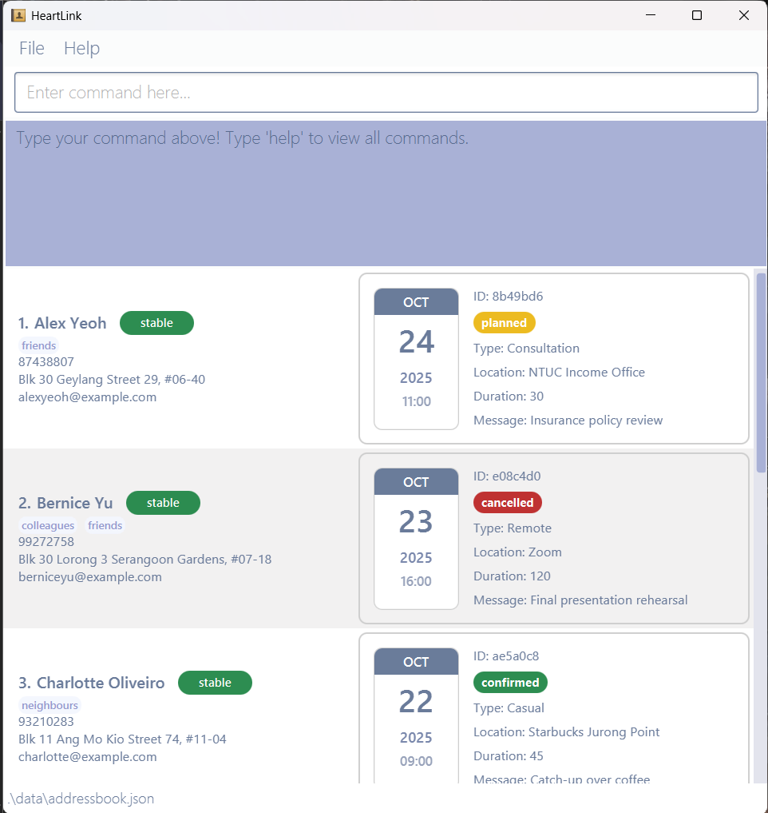
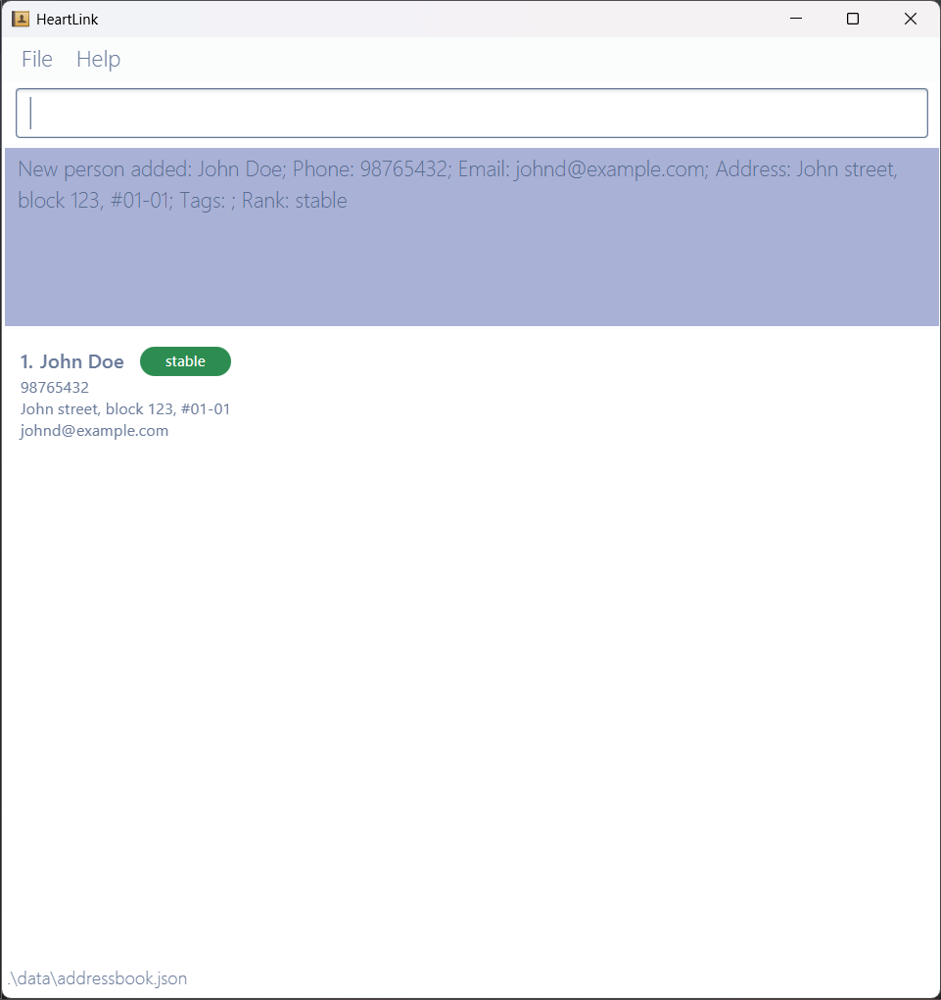
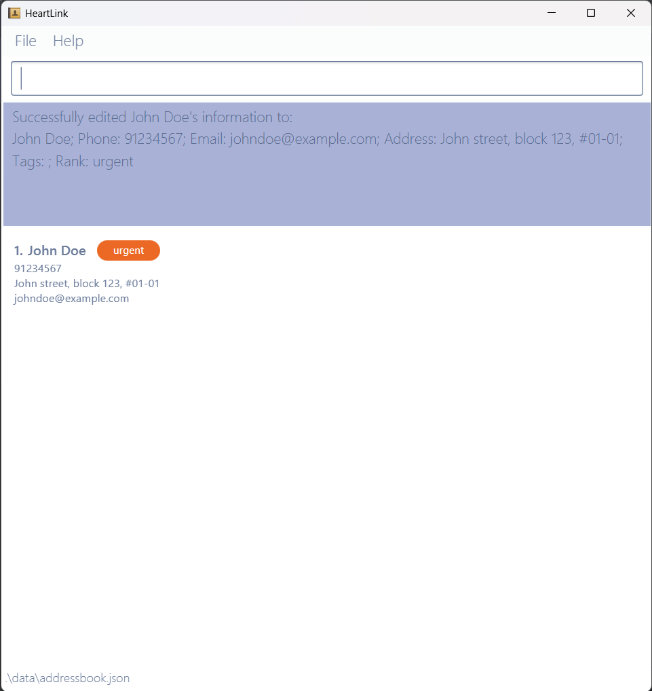
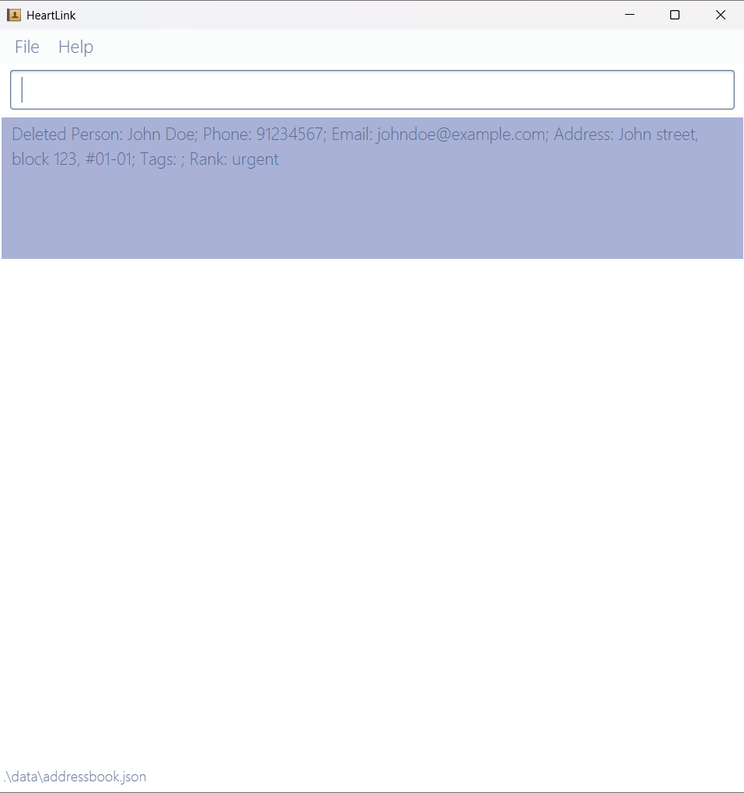
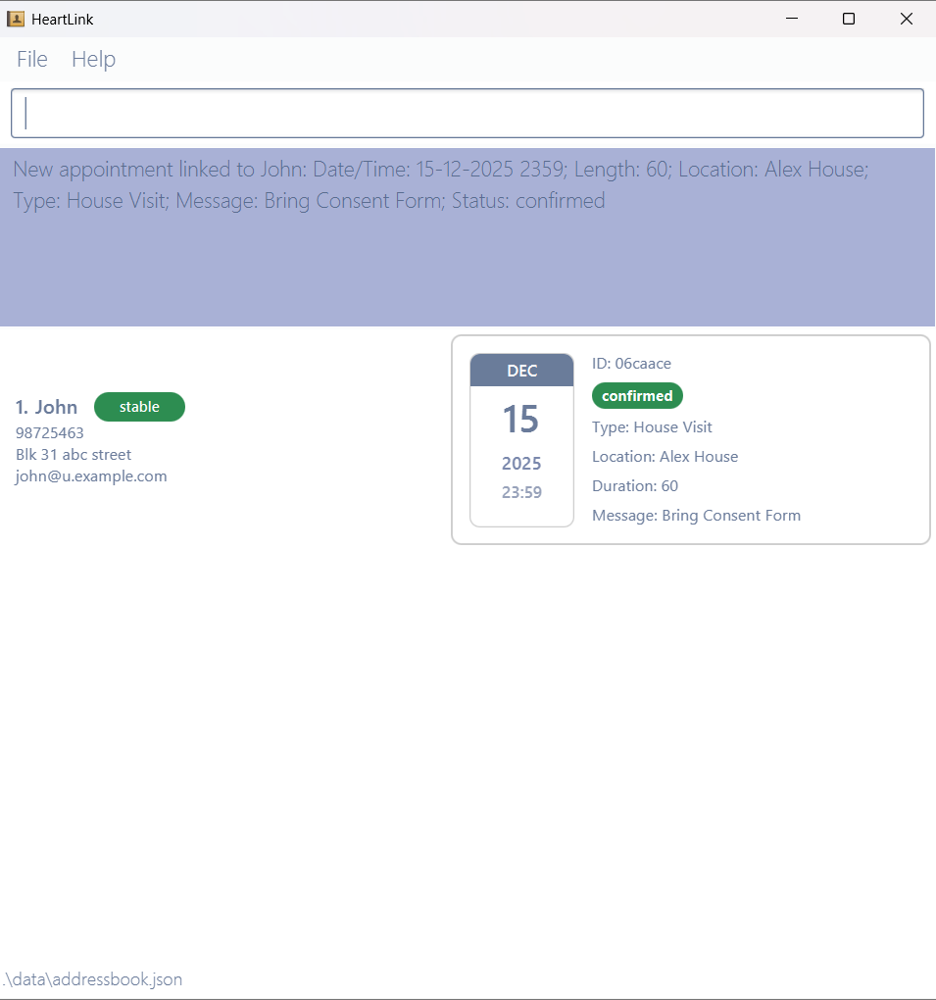
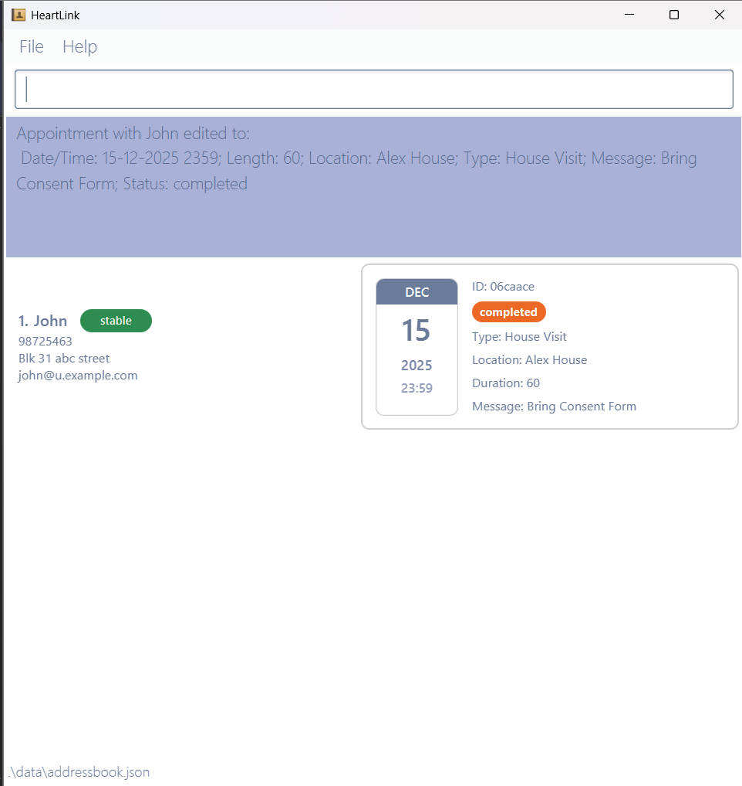
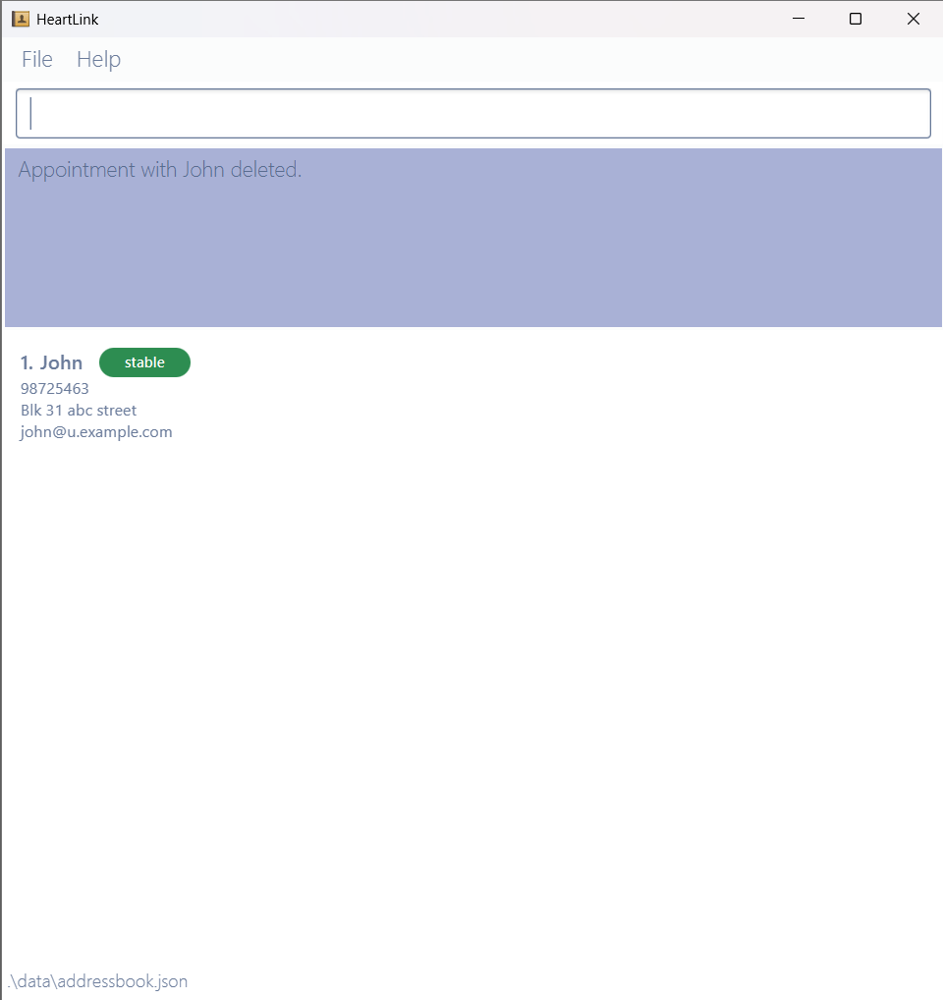
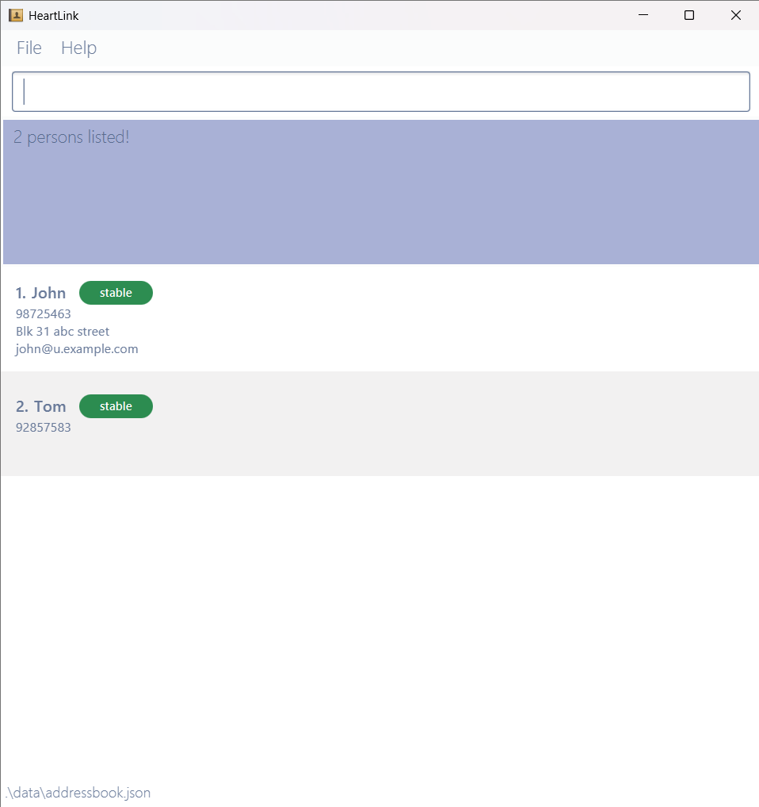
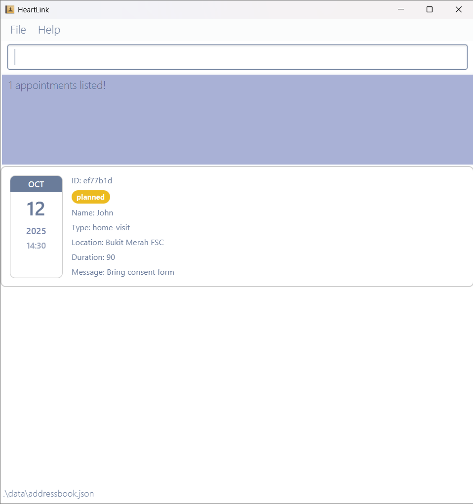

HeartLink is a **desktop app** made for **social workers in Singapore** to help you **stay organized and work efficiently**. 
If you type fast, HeartLink lets you **efficiently store** your clients’ details—names, phone numbers, and notes—and **link them directly** to appointments 
so you **never miss** an important meeting.

Optimized for use via a Command Line Interface (CLI) while still offering the benefits of a Graphical User Interface (GUI), 
HeartLink helps you **spend less time navigating** menus and **more time focusing** on what matters: ***your clients***.

## Table of Contents

<ol>
    <li><a href="#about-this-guide">About this guide</a></li>
    <li><a href="#quick-start">Quick start</a></li>
    <li><a href="#features">Features</a>
        <ol type="a">
            <li><a href="#command-summary">Command summary</a></li>
            <li><a href="#list-of-commands">List of commands</a>
                <ol type="i">
                    <li><a href="#1-viewing-help--help">Viewing help <code>help</code></a></li>
                    <li><a href="#2-adding-a-person-add">Adding a person <code>add</code></a></li>
                    <li><a href="#3-listing-all-persons--list">Listing all persons <code>list</code></a></li>
                    <li><a href="#4-editing-a-person--edit">Editing a person <code>edit</code></a></li>
                    <li><a href="#5-deleting-a-person--delete">Deleting a person <code>delete</code></a></li>
                    <li><a href="#6-managing-appointments-with-clients--link">Managing Appointments with Clients</a>
                        <ol type="1">
                          <li><a href="#i-creating-an-appointment-link--c">Creating appointments <code>link -c</code></a></li>
                          <li><a href="#ii-editing-an-appointment--link--e">Editing appointments <code>link -e</code></a></li>
                          <li><a href="#iii-deleting-an-appointment--link--d">Deleting appointments <code>link -d</code></a></li>
                        </ol>
                    </li>
                    <li><a href="#7-looking-up-clients-by-fields-find">Looking up clients by fields <code>find</code></a>
                        <ol type="1">
                            <li><a href="#i-client-name-keyword">Client name</a></li>
                            <li><a href="#ii-client-phone-number-phone">Client phone number</a></li>
                            <li><a href="#iii-client-email-email">Client email</a></li>
                            <li><a href="#iv-client-tag-tag">Client tag</a></li>
                            <li><a href="#v-client-rank-rank">Client rank</a></li>
                            <li><a href="#vi-chaining-client-attributes">Chaining attributes</a></li>
                        </ol>
                    </li>
                    <li><a href="#8-looking-up-appointments-by-fields-find">Looking up appointments by fields <code>find</code></a>
                        <ol type="1">
                            <li><a href="#i-appointment-meeting-time-date-time">Appointment meeting time</a></li>
                            <li><a href="#ii-appointment-status-status">Appointment status</a></li>
                            <li><a href="#iii-appointment-type-type">Appointment type</a></li>
                            <li><a href="#iv-chaining-commands">Chaining all attributes</a></li>
                        </ol>
                    </li>
                    <li><a href="#9-clearing-all-entries--clear">Clearing all entries <code>clear</code></a></li>
                    <li><a href="#10-exiting-the-program--exit">Exiting the program <code>exit</code></a></li>
                </ol>
            </li>
            <li><a href="#other-features">Other features</a></li>
        </ol>
    </li>
    <li><a href="#warnings">Common Errors</a>
        <ol type="1">
            <li><a href="#command-related-errors">Command-related errors</a>
                <ol type="1">
                    <li><a href="#1-add">add</a></li>
                    <li><a href="#2-edit">edit</a></li>
                    <li><a href="#3-delete">delete</a></li>
                    <li><a href="#4-link">link</a></li>
                    <li><a href="#5-find">find</a></li>
                </ol>
            </li>
            <li><a href="#tag-related-errors-general">Tag-related errors (General)</a></li>
            <li><a href="#tag-related-errors-appointment">Tag-related errors (Appointment)</a></li>
            <li><a href="#other-errors">Other errors</a></li>
        </ol>
    </li>
    <li><a href="#faq">FAQ</a></li>
</ol>


--------------------------------------------------------------------------------------------------------------------

## About this guide

This guide provides instructions for Social Workers in Singapore on how to efficiently *manage client contacts and appointments* through program functions, including adding, editing, deleting, and searching entries using HeartLink.

**Assumed Prior Knowledge:**

* Knowledge of whether your operating system (OS) is running Windows, macOS, or Linux.
* Comfortable using a command-line interface on Windows, macOS, or Linux.
* Familiar with basic command-line actions like copying, pasting commands, and editing plain text files.
* Knowledge of your role and responsibilities as a social worker in managing client contacts and appointments.

**How to Use This Guide:**

* Quick Start: Learn how to launch the app and get familiar with basic commands.
* Features: In-depth explanations of each command, with syntax, usage steps, examples, and helpful tips.
* Troubleshooting & FAQ: Solutions to common problems and answers to frequently asked questions.

[Back to table of contents](#table-of-contents)

## Quick start

1. Ensure you have Java `17` or above installed in your Computer.<br>

   > **How to check if you have Java `17` or above?**
   >
   > 1. Open a command terminal.<br>
        - **Windows users**: Press `Windows + R`, type `cmd`, and press Enter.<br>
        - **Mac users**: Open **Terminal** from Spotlight (press `⌘ + Space`, type `Terminal`).<br>
        - **Linux users**: Open **Terminal** from your applications menu.
   > 2. Type `java -version` and press Enter.
   > 3. If Java is installed, you’ll see the version number (e.g., `java version "17.0.1"`).
   > 4. The first number should be `17`.

   > **If Java is not installed or the version is below 17:**
   > 
   > 1. Download and install Java 17 by following the guide:<br>
        - For **Windows users**: [Windows installation guide](#https://se-education.org/guides/tutorials/javaInstallationWindows.html).<br>
        - For **Mac users**: [Mac installation guide](#https://se-education.org/guides/tutorials/javaInstallationMac.html).<br>
        - For **Linux users**: [Linux installation guide](#https://se-education.org/guides/tutorials/javaInstallationLinux.html)<br>
   > 2. After installation, restart your terminal and repeat the above steps to verify the version again.

2. Download the latest `.jar` file from [here](https://github.com/AY2526S1-CS2103T-T09-1/tp/releases).

3. Copy the file to the folder you want to use as the _home folder_ for HeartLink.

4. Run HeartLink using the `java -jar HeartLink.jar` command.<br>

   > **How to run HeartLink?** (for beginners) <br>
   > 1. Open start and search for Command Prompt or Terminal.
   > 2. Type `cd [filename]` to navigate to the folder with your HeartLink jar. <br>
   >  E.g. If your jar is in `Users\(name)\Downloads` and you are currently
   >  in `Users\(name)`, you will type `cd Downloads` in the terminal).
   > 3. Type `java -jar HeartLink.jar` and HeartLink will open!

    A GUI similar to the image below should appear in a few seconds. Note how the app contains some sample data.<br>
    
    

5. Try typing some command in the command box and press Enter to execute it. <br> E.g. typing **`help`** and pressing Enter will open the help window.<br>
   Some example commands you can try:

   * `list` : Lists all contacts.

   * `add n/John Doe p/98765432 e/johnd@example.com a/John street, block 123, #01-01` : Adds a contact named `John Doe` to the Address Book.

   * `edit John Doe n/John Doe p/91234567 e/johndd@example.com a/John Road, block 123, #01-01` : Edits a contact named `John Doe` in the Address Book.

   * `delete John Doe` : Deletes `John Doe` from the list of contacts.

   * `clear` : Deletes all contacts.

   * `exit` : Exits the app.

6. Refer to the [Features](#features) below for more features with its details.

[Back to table of contents](#table-of-contents)

---

## Features

<div markdown="block" class="alert alert-info" id="command-format">

**:information_source: Notes about the command format:**<br>

* Words in `UPPER_CASE` are the parameters to be supplied by the user.<br>
  e.g. in `add n/NAME`, `NAME` is a parameter which can be used as `add n/John Doe`.

* Items in square brackets are optional.<br>
  e.g `n/NAME [t/TAG]` can be used as `n/John Doe t/friend` or as `n/John Doe`.

* Items with `…`​ after them can be used multiple times including zero times.<br>
  e.g. `[t/TAG]…​` can be used as ` ` (i.e. 0 times), `t/friend`, `t/friend t/family` etc.

* Parameters can be in any order.<br>
  e.g. if the command specifies `n/NAME p/PHONE_NUMBER`, `p/PHONE_NUMBER n/NAME` is also acceptable.

* Extraneous parameters for commands that do not take in parameters (such as `help`, `list`, `exit` and `clear`) will be ignored.<br>
  e.g. if the command specifies `help 123`, it will be interpreted as `help`.

* If you are using a PDF version of this document, be careful when copying and pasting commands that span multiple lines 
  as space characters surrounding line-breaks may be omitted when copied over to the application.
</div>

### Command summary

| Action                                                             | Format, Examples                                                                                                                                                                                               |
|--------------------------------------------------------------------|----------------------------------------------------------------------------------------------------------------------------------------------------------------------------------------------------------------|
| **[Add Client](#2-adding-a-person-add)**                           | `add n/NAME p/PHONE_NUMBER [e/EMAIL] [a/ADDRESS] [r/RANK] [t/TAG]…​`<br>e.g. `add n/James Ho p/92248444 e/jamesho@example.com a/123 Clementi Rd t/friend r/stable`                                             |
| **[Edit Client](#4-editing-a-person--edit)**                       | `edit OLD_NAME [n/NEW_NAME] [p/PHONE_NUMBER] [e/EMAIL] [a/ADDRESS] [r/RANK] [t/TAG]…​`<br>e.g. `edit John Doe p/91234567 e/johndoe@example.com r/urgent`                                                       |
| **[Delete Client](#5-deleting-a-person--delete)**                  | `delete NAME`<br>e.g. `delete John Doe`                                                                                                                                                                        |
| **[List Client](#3-listing-all-persons--list)**                    | `list`                                                                                                                                                                                                         |
| **[Create Appointment](#i-creating-an-appointment-link--c)**       | `link -c n/NAME appt/DATE TIME len/MINUTES [loc/LOCATION] [type/TYPE] [msg/MESSAGE] [status/STATUS]`<br>e.g. `link -c n/Alex appt/15-12-2025 2359 type/House Visit loc/Alex House len/60 msg/Bring Consent Form` |
| **[Edit Appointment](#ii-editing-an-appointment--link--e)**        | `link -e id/APPOINTMENT_ID [appt/DATE TIME] [len/MINUTES] [loc/LOCATION] [type/TYPE] [msg/MESSAGE] [status/STATUS]`<br>e.g. `link -e id/107f3db type/Friendly Chat loc/cafe msg/Bring gift`                    |
| **[Delete Appointment](#iii-deleting-an-appointment--link--d)**    | `link -d id/APPOINTMENT_ID`<br>e.g. `link -d id/1b9a395`                                                                                                                                                       |
| **[Find Clients](#7-looking-up-clients-by-fields-find)**           | `find [n/NAME] [p/PHONE] [e/EMAIL] [t/TAG] [r/RANK]`<br>e.g. `find n/Alex r/urgent`                                                                                                                            |
| **[Find Appointments](#8-looking-up-appointments-by-fields-find)** | `find [appt/TIME] [status/STATUS] [type/TYPE]`<br>e.g. `find appt/today`                                                                                                                                       |
| **[Clear All Entries](#9-clearing-all-entries--clear)**            | `clear`                                                                                                                                                                                                        |
| **[Help](#1-viewing-help--help)**                                  | `help`                                                                                                                                                                                                         |
| **[Exit Program](#10-exiting-the-program--exit)**                  | `exit`                                                                                                                                                                                                         |

[Back to table of contents](#table-of-contents)

--------------------------------------------------------------------------------------------------------------------

### List of commands:

<div markdown="block" class="alert alert-info">

**:information_source: Notes about the acceptable inputs:**<br>

* **n/NAME**: This specifies the name of the client. Your input must be alphanumeric. <br> 
  E.g. `John Doe`  
* **p/PHONE_NUMBER**: This specifies the phone number of the client. Your input should only contain 8 digits starting with 6, 8 or 9. You may choose to include the `+65` country code at the start (not included in the 8 digits). <br>
  You may choose to include spaces but they are only allowed after +65 and in the middle of the 8 digits <br>
  E.g. `+6598765432`, `+65 98765432`, `+65 9876 5432`, `98765432` or `9876 5432`.
* **e/EMAIL**: This specifies the email address of the client. Your input must be in this format `[LOCAL]@[DOMAIN].[TOP-LEVEL DOMAIN]`.
  The local and domain parts should be alphanumeric characters. <br> 
  E.g. `johndoe@example.com`
* **a/ADDRESS**: This specifies the address of the client. Your input must be alphanumeric. Special characters like `# - , . ( ) / ; : &` are accepted. <br>
  E.g. `John street, block 123, #01-01`
* **t/TAG**: This specifies the tag(s) of the client. Your input must be alphanumeric. <br>
  E.g. `friend` or `patient`
* **r/RANK**: This specifies the priority rank of the client. You can only input four types of priority, `stable` , `vulnerable` , `urgent` and `crisis` (all case-insensitive). <br>

</div>

### 1. Viewing help : `help`

Shows a message explaining how to access the help page.


#### Format: 
```
help
```
> :bulb: **Tips:**
> Any additional information after the command is being ignored.
> e.g. `help [anything]` works.
> e.g. `help [anything]` works.

#### Expected output:
```
Opened help window.
```
Additionally, a pop-up help window should appear with a link to our user guide.

[Back to table of contents](#table-of-contents)

### 2. Adding a person: `add`

Adds a person to the address book.

#### Format: 
```
add n/NAME p/PHONE_NUMBER [e/EMAIL] [a/ADDRESS] [r/RANK] [t/TAG]…​
```

> :bulb: **Tips:**
> 
> * All required fields must be provided.
> * A person can have any number of tags (including 0). Unsure how? Refer [here](#command-format).

<div markdown="block" class="alert alert-info" id="client-acceptable-inputs">

**:information_source: Here’s the fields and their acceptable inputs relating to clients:**<br>

* **n/NAME**: This specifies the name of the client. Your input must be alphanumeric. <br>
  E.g. `John Doe`
* **p/PHONE_NUMBER**: This specifies the phone number of the client. Your input should only contain 8 digits starting with 6, 8 or 9. You may choose to include the `+65` country code at the start (not included in the 8 digits). <br>
  You may choose to include spaces but they are only allowed after +65 and in the middle of the 8 digits <br>
  E.g. `+6598765432`, `+65 98765432`, `+65 9876 5432`, `98765432` or `9876 5432`.
* **e/EMAIL**: This specifies the email address of the client. Your input must be in this format `[LOCAL]@[DOMAIN].[TOP-LEVEL DOMAIN]`.
  The local and domain parts should be alphanumeric characters. <br>
  E.g. `johndoe@example.com`
* **a/ADDRESS**: This specifies the address of the client. Your input must be alphanumeric. Special characters like `# - , . ( ) / ; : &` are accepted. <br>
  E.g. `John street, block 123, #01-01`
* **t/TAG**: This specifies the tag(s) of the client. Your input must be alphanumeric. <br>
  E.g. `friend` or `patient`
* **r/RANK**: This specifies the priority rank of the client. You can only input four types of priority, `stable` , `vulnerable` , `urgent` and `crisis` (all case-insensitive). <br>

</div>

#### Examples:
* `add n/John Doe p/98765432 e/johnd@example.com a/John street, block 123, #01-01 r/stable`
Adds a new client named John Doe with phone number 98765432, email address johnd@example.com, address John street, block 123, #01-01, and ranks the client as stable.
* `add n/Betsy Crowe e/betsycrowe@example.com a/Newgate Prison p/91234567 t/criminal t/friend`
Adds a new client named Betsy Crowe with email address betsycrowe@example.com, phone number 91234567, address Newgate Prison, and assigns two tags criminal and friend to the client.

#### Expected output:
```
New person added: NAME; Phone: PHONE; Email: EMAIL; Address: ADDRESS; Tags: [TAG1][TAG2]…​; Rank: RANK
```



[Back to table of contents](#table-of-contents)

### 3. Listing all persons : `list`

Shows a list of all persons in the address book.

#### Format: 
```
list
```
> :bulb: **Tips:**
> 
> Any additional information after the command is being ignored.
> e.g. `list [anything]` works.

#### Expected output:
```
Listed all persons
```
All contacts in address book should be listed.

[Back to table of contents](#table-of-contents)

### 4. Editing a person : `edit`

Edits an existing person in the address book.

Format: 
```
edit OLD_NAME [n/NEW_NAME] [p/PHONE] [e/EMAIL] [a/ADDRESS] [r/RANK] [t/TAG]…​
```

> :bulb: **Tips:**
> * Edits the person at the specified `OLD_NAME`. The old name refers to the person's name before editing.
> * At least one of the optional fields must be provided.
> * Existing values will be updated to the input values.
> * When editing tags, the existing tags of the person will be removed i.e adding of tags is not cumulative.
> * You can remove all the person’s tags by typing `t/ ` without specifying any tags after it.
> * You can use any combinations of the fields.
> * You may refer to the above acceptable inputs [here](#client-acceptable-inputs).

Examples:
*  `edit John Doe p/91234567 e/johndoe@example.com r/urgent`  
Edits the phone number and email address of John Doe to be `91234567`, `johndoe@example.com` respectively
and ranks the contact as `urgent`.
*  `edit Betsy Crownerrr n/Betsy Crower t/`  
Edits the name of the 2nd person to be `Betsy Crower` and clears all existing tags.

#### Expected output:
```
Successfully edited OLD_NAME's information to:
EDITED_NAME; Phone: EDITED_PHONE; Email: EDITED_MAIL; Address: EDITED_ADDRESS; Tags: [EDITED_TAGS]; Rank: EDITED_RANK 
```
*EDITED_FIELD represents the old value if not specified in command, and represents new value if specified.

The contact is updated to the address book.



[Back to table of contents](#table-of-contents)

### 5. Deleting a person : `delete`

Deletes the specified person from the address book.

Format: 
```
delete NAME
```

> :bulb: **Tips:**
> * Deletes the person at the specified `NAME`.
> * The NAME must be the same as the name reflected in HeartLink.

Example:
* You have a person named `Alex Yeoh` in HeartLink. <br>
  By executing `delete Alex Yeoh`, `Alex Yeoh` will be removed from HeartLink.

#### Expected output:
```
Deleted Person: NAME; Phone: PHONE; Email: EMAIL; Address: ADDRESS; Tags: [TAGS]; Rank: RANK
```
The contact is deleted from the address book.



[Back to table of contents](#table-of-contents)

### 6. Managing Appointments with Clients : `link`

Adds, edits, or deletes appointments linked to clients.  
These commands allows social workers to record, track, and manage client appointments efficiently.

##### Here's the shortcut link to the three commands:
- [Creating appointment](#i-creating-an-appointment-link--c)
- [Editing appointment](#ii-editing-an-appointment--link--e)
- [Deleting appointment](#iii-deleting-an-appointment--link--d)

<div markdown="block" class="alert alert-info">

**:information_source: Here's the fields and their acceptable inputs relating to appointment:**<br>

* **n/NAME**: This specifies the client the appointment is linking to. Your input must be alphanumeric and should be an existing name in contact list.
* **appt/DATE TIME**: This specifies the date and time of the appointment. Your input must be a valid calendar date in the format `dd-MM-yyyy HHmm`,`d-MM-yyyy HHmm`, `dd-M-yyyy HHmm` or `d-M-yyyy HHmm`.
  <br> E.g. `04-07-2025 0930`, `4-07-2025 0930`, `04-7-2025 0930` or `4-7-2025 0930`
* **id/APPOINTMENT_ID**: This is an unique ID of the appointment. You do NOT need to create an ID. It will be generated once the appointment is created.
* **len/MINUTES**: This specifies the length of appointment. Your input must be a positive integer, in **minutes** <br> E.g. `45`
* **loc/LOCATION**: This specifies the location of the appointment. Your input can contain letters, numbers, and symbols `, . # - / ( ) ' ; & :`. <br> E.g. `Blk 10 Tampines Ave 3 #02-15`
* **type/TYPE**: This specifies the type of the appointment. Any input is acceptable. <br> E.g. `House Visit`, `Follow-up Call`, `Counselling Session`.
* **msg/MESSAGE**: This specifies any note or reminder for the appointment. Any input is acceptable <br> E.g. `Bring consent form and medical report`.
* **status/STATUS**: This specifies the status of the appointment. You can only input four types of status, `planned` , `confirmed` , `completed` and `cancelled` (all case-insensitive).
  It is given the `planned` status by default.

</div>

[Back to table of contents](#table-of-contents)

#### i. Creating an appointment `link -c`

Creates a new appointment and links it to a client.
Each appointment automatically receives a unique `Appointment ID`.

Format:
```
link -c n/NAME appt/DATE TIME len/MINUTES [loc/LOCATION] [type/TYPE] [msg/MESSAGE] [status/STATUS]
```

<div markdown="span" class="alert alert-info">:exclamation: **Remarks:**

- Both date and time can be specified, or just the date for all-day appointments.
Ensure that the appointment does not clash. Please refer to [this](#appointment-clashes) for more details.

- A random unique `Appointment ID` is generated automatically.

- All unspecified optional fields default to empty values or `"planned"` status.

- Note that fields in `[]` are optional!
- Status can only be one of the words: status|planned|confirmed|completed
</div>

Examples:
* `link -c n/Alex appt/15-12-2025 2359 len/60 loc/Alex House type/House Visit msg/Bring Consent Form status/confirmed`
<br> Creates a **House Visit** appointment with Alex on **15 Dec 2025, 11:59PM**, lasting **60 minutes**, with a message **“Bring Consent Form”**, marked as **confirmed**.
* `link -c n/Ben appt/10-01-2026 1230 len/30`
<br> Creates a 30-minute appointment with Ben on **10 Jan 2026, 12:30PM** with unspecified location, type, message and status set to **planned** by default.

**Expected Output:**
```
New appointment linked to NAME: Date/Time: DATE TIME; Length: LENGTH; Location: LOCATION; Type: TYPE; Message: MESSAGE; Status: STATUS
```
The appointment is linked to the person specified in the command.



[Back to table of contents](#table-of-contents)

#### ii. Editing an Appointment : `link -e`

Edits details of an existing appointment using its `Appointment ID`.

Format:
```
link -e id/APPOINTMENT_ID [appt/DATE TIME] [len/MINUTES] [loc/LOCATION] [type/TYPE] [msg/MESSAGE] [status/STATUS]
```

<div markdown="span" class="alert alert-info">:exclamation: **Remarks:**

- You can edit multiple fields at once or just one.

- Only specified fields are updated, unspecified fields remain unchanged.

- The appointment ID (`id/`) can be seen from the client card display.

- Ensure that the appointment does not clash. Please refer to [this](#appointment-clashes) for more details.

- Note that fields in `[]` are optional!
</div>

Examples:
* `link -e id/107f3db status/completed` <br>
Marks appointment with id `107f3db` as **completed**.

* `link -e id/1b9a395 appt/18-12-2025 1500 loc/Office msg/Rescheduled meeting` <br>
Edits appointment `1b9a395` to reschedule the date and time to **18 Dec 2025, 3:00PM**, with the new location **Office** and message **“Rescheduled meeting”**.

**Expected Output:**
```
Appointment with NAME edited to:
 Date/Time: DATE TIME; Length: LENGTH; Location: LOCATION; Type: TYPE; Message: MESSAGE; Status: STATUS
```
The appointment with the same ID specifed in the command, is edited with the new information.



[Back to table of contents](#table-of-contents)

#### iii. Deleting an Appointment : `link -d`

Deletes an existing appointment from a client’s record.

Format: 
```
link -d id/APPOINTMENT_ID
```

<div markdown="span" class="alert alert-info">:exclamation: **Remarks:**
- Deleting an appointment cannot be undone.
- Once deleted, it will be removed from both the client’s appointment list and the database.
</div>

Example:
* `link -d id/1b9a395` <br>
  Deletes the appointment with ID `1b9a395`.

**Expected Output:**
```
Appointment with NAME deleted.
```
The appointment with the same ID specifed in the command, is deleted.



[Back to table of contents](#table-of-contents)

### 7. Looking up clients by fields: `find`

Here is the first part of `find` command specific for clients.
[Click here](#8-looking-up-appointments-by-fields-find) to go to the second part for finding by appointment!

Format:
```
find [n/KEYWORD_1 KEYWORD_2 ...] [p/PHONE] [e/EMAIL] [t/TAG] [r/RANK]
```

You can use this command to retrieve a list of clients that match the specified attributes:

<div markdown="span" class="alert alert-info">:exclamation: **Remarks:**
The order of the attributes does not matter. If you haven't specified any attributes, the system will list all clients.
</div>

##### Here's the list of attributes for client:
* [Client name](#i-client-name-keyword)
* [Client phone number](#ii-client-phone-number-phone)
* [Client email](#iii-client-email-email)
* [Client tag](#iv-client-tag-tag)
* [Client rank](#v-client-rank-rank)
* [Chaining attributes](#vi-chaining-client-attributes)

[Back to table of contents](#table-of-contents)

#### i. Client name `KEYWORD`

Lists all clients whose names contain any of the specified keywords.
The search is case-insensitive.
Example:
* You have a `Alex Yeoh` and a `Alex Tan` in Heartlink. <br>
  Executing `find n/Alex` would list both `Alex Yeoh` and `Alex Tan` as they have `Alex` in their name.

[Back to attribute list](#heres-the-list-of-attributes-for-client)

#### ii. Client phone number `PHONE`
Lists all clients whose phone numbers exactly match `PHONE`.

Example:
* `find p/98765432` lists the contacts that has they same phone number inputted.

[Back to attribute list](#heres-the-list-of-attributes-for-client)

#### iii. Client email `EMAIL`
Lists all clients whose email exactly match `EMAIL`.

Example:
* `find e/johndoe@example.com` lists the contacts that has they same email inputted.

[Back to attribute list](#heres-the-list-of-attributes-for-client)

#### iv. Client tag `TAG`
Lists all clients whose tag contains `TAG`.

Example:
* `find t/friend` lists the contacts that is tagged as `friend`.

[Back to attribute list](#heres-the-list-of-attributes-for-client)

#### v. Client rank `RANK`
Lists all clients whose rank exactly match `RANK`.

Example:
* `find r/stable` lists the contacts that has the `stable` rank.

[Back to attribute list](#heres-the-list-of-attributes-for-client)

#### vi. Chaining client attributes
You can also type different attributes at once

Examples:
* `find n/John Doe r/urgent` <br>
  allows you to list all urgent clients whose name contains "John" or "Doe.
* `find p/81234567 t/patient` <br>
  allows you to list all clients with tag patients and phone number 81234567.

**Expected Output:**
```
X persons listed!
```
The address book lists all contacts that fits the specified constraints.



[Back to attribute list](#heres-the-list-of-attributes-for-client)

[Back to table of contents](#table-of-contents)

### 8. Looking up appointments by fields `find`

Here is the second part of `find` command specific for appointments.
[Click here](#7-looking-up-clients-by-fields-find) to go back to the first part for finding by client!

Format:
```
find [appt/DATE [TIME]] [status/STATUS] [type/TYPE]
```

You can use this command to retrieve a list of appointments
that match the specified attributes.

##### Here's the list of attributes for appointment:
* [Appointment meeting time](#i-appointment-meeting-time-date-time)
* [Appointment status](#ii-appointment-status-status)
* [Appointment type](#iii-appointment-type-type)
* [Chaining all attributes](#iv-chaining-commands)

[Back to table of contents](#table-of-contents)

#### i. Appointment meeting time `DATE [TIME]`

List all appointments that  overlap with the specified time. 

Examples:
* `find appt/24-10-2025 1000 to 24-10-2025 1100` <br>
List all appointments between 24th October 2025 10 - 11 am.
* `find appt/04-07-2025` <br>
List all appointments on 4th July 2025.
* `find appt/today` <br>
List today's appointment.
* `find appt/+3`<br>
List all appointments in the upcoming three days.

[Back to list of attributes](#heres-the-list-of-attributes-for-appointment)

#### ii. Appointment status `STATUS`
List all appointments with the given status. 

Example:
* `find status/cancelled`<br>
List all cancelled appointments for you.

[Back to list of attributes](#heres-the-list-of-attributes-for-appointment)

#### iii. Appointment type `TYPE`
List all appointments with the given type. 

Example:
* `find type/GIC-Meeting` <br>
List out all meetings with GIC for you.

[Back to list of attributes](#heres-the-list-of-attributes-for-appointment)

#### iv. Chaining commands
It is possible to chain these fields with [client fields](#7-look-up-clients-by-fields-find).

Example:
* `find r/urgent appt/today`
This command allows you to find today's appointment for urgent clients.

> Although the leading command to list appointments and clients is the same, the behavior differs depending on the fields provided.
If you include any appointment-related fields, such as `appt/`, `status/`, or `type/`, the system will list appointments.
However, providing client-related fields alone only trigger a client listing view instead.
For example,
> - `find r/urgent` will show list of all clients with their respective appointments.
> - `find r/urgent appt/today` will only show list of appointments.
>
> The order of the attributes does not matter.

**Expected Output:**
```
X appointments listed!
```
The address book lists all appointments that fits the specified constraints.



[Back to list of attributes](#heres-the-list-of-attributes-for-appointment)

[Back to table of contents](#table-of-contents)

### 9. Clearing all entries : `clear`

Clears all entries from the address book.

Format: 
```
clear
```

**Expected Output:**
```
Address book has been cleared!
```
All contacts on the address book will be deleted.

[Back to table of contents](#table-of-contents)

### 10. Exiting the program : `exit`

Exits the program.

Format: 
```
exit
```

[Back to table of contents](#table-of-contents)

--------------------------------------------------------------------------------------------------------------------

### Other features:

### Saving the data

HeartLink data are saved in the hard disk automatically after any command that changes the data. There is no need to save manually.

### Editing the data file

HeartLink data are saved automatically as a JSON file `[JAR file location]/data/addressbook.json`. 

<div markdown="span" class="alert alert-warning">:exclamation: **Caution:**
If you are familiar with JSON, you are welcome to update data directly by editing that data file! <br>
However, do note that if the changes make the format invalid(e.g. values out of range, missing field), HeartLink will discard all data and start with an empty data file at the next run. 
Hence, it is recommended to take a backup of the file before editing it.<br>
</div>

### Appointment clashes
If you attempt to create or edit an appointment with a confirmed status, you may encounter appointment clashes. 
Two appointments clash when:
- Both appointments are set to the confirmed status. 
- Both appointments are for the same client.
- Both appointments have overlapping timings.

HeartLink does not allow this to happen, and you will get an error message. 
For example, suppose that your current address book is as follows.
```json
{
  "persons" : [
    {
      "name": "Alex Yeoh",
      "appointments": [
        {
          "id": "e271471",
          "dateTime": "24-10-2025 1100",
          "length": "30",
          "status": "confirmed"
        },
        {
          "id": "e125428",
          "dateTime": "24-10-2025 1120",
          "length": "30",
          "status": "planned"
        }
      ]
    }
  ]
}
```
Note that the appointment `e271471` and `e125428` do not clash because one of the appointments are
not confirmed.
If you execute the command:`link -c n/Alex Yeoh appt/24-10-2025 1030 len/30 status/confirmed`, 
you will receive an error message because the time slot `1100 - 1130` overlaps with `1030-1100`.
```
Two confirmed appointments clash. 
[old: e271471] 24-10-2025 1100
[new] 24-10-2025 1030
```
Similarly, if you attempt to change appointment status in `e125428` to `confirmed`, you still got the error.
```
Two confirmed appointments clash. 
[old: e271471] 24-10-2025 1100
[new: e125428] 24-10-2025 1120
```

[Back to table of contents](#table-of-contents)

--------------------------------------------------------------------------------------------------------------------
## Warnings
**Here's a shortcut list to the types of errors**
1. [Command-related errors](#command-related-errors)
2. [Tag-related errors (General)](#tag-related-errors-general)
3. [Tag-related errors (Appointment)](#tag-related-errors-appointment)
4. [Other errors](#other-errors)

[Back to table of contents](#table-of-contents)

### Command-related errors
**Here's a summary of command-related errors**
1. [add](#1-add)
2. [edit](#2-edit)
3. [delete](#3-delete)
4. [link](#4-link)
5. [find](#5-find)

[Back to table of contents](#table-of-contents)

#### 1. `add`
- Invalid syntax: `add` `add test` `add n/test` `add n/John Doe 12345678`
    ```
    Invalid command format! 
    add: Adds a person to the address book. Parameters: n/NAME p/PHONE [e/EMAIL] [a/ADDRESS] [t/TAG]... [r/RANK]
    Example: add n/John Doe p/98765432 e/johnd@example.com a/311, Clementi Ave 2, #02-25 t/friends t/owesMoney r/stable
    ```
- Duplicated person:
   ```
   This person already exists in the address book
   ```
[Back to table of contents](#table-of-contents)

#### 2. `edit`
- Invalid syntax: `edit` `edit test` 
   ```
   Invalid command format. Please ensure that the command adheres to the following:
   - Edit name: edit NAME n/NEW_NAME
   - Edit tags (able to chain more than 1 tag): edit NAME t/TAG
   - Edit home address: edit NAME a/ADDRESS
   - Edit phone number: edit NAME p/PHONE
   - Edit email address: edit NAME e/EMAIL
   - Combinations: edit NAME t/TAG p/PHONE ...
    ```
- Invalid name of contact to edit: `edit John Doe n/newName` when the contact `John Doe` don't exist.
    ```
   The person's name provided is invalid
   ```
[Back to table of contents](#table-of-contents)
  
#### 3. `delete`
- Invalid name of contact to delete: `delete`
    ```
   Names should only contain alphanumeric characters and spaces, and it should not be blank
   ```
[Back to table of contents](#table-of-contents)
 
#### 4. `link`
- No flag: `link` `link n/john` `link n/john appt/12-12-2025`
  ```
  Invalid command format! 
  Please include a flag after command.
  i.e. To create an appointment: link -c [PARAMETERS], to delete an appointment: link -d [PARAMETERS], to edit an appointment: link -e [PARAMETERS]
  ```
- Invalid flag: `link -a ` `link -a n/john appt/12-12-2025`
  ```
  Invalid Flag!
  ```
- Invalid syntax for create appointment: `link -c` `link -c name`
  ```
  Invalid command format!
  Create flag: Links a new appointment to a client. 
  Parameters: link -c n/NAME appt/DATE TIME len/MINUTES [loc/LOCATION] [type/TYPE] [msg/NOTES] [status/planned|confirmed|completed|cancelled] 
  Example: link -c n/Alex Wu appt/12-10-2025 1430 len/90 loc/Bukit Merah FSC type/home-visit msg/Bring consent form status/planned
  ```
- Invalid name to link the appointment to: `link -c n/John appt/12-12-2025 2359` when `John` is not in the address book.
  ```
  No client found with the name: john
  ```
- Invalid syntax for edit appointment: `link -e` `link -e id` `link -e id/1234567`
  ```
  Invalid command format!  
  Edit flag: Updates an existing appointment for a client. 
  Parameters: link -e id/ID [n/NAME ] [appt/DATE TIME] [len/MINUTES] [loc/LOCATION] [type/TYPE] [msg/NOTES] [status/planned|confirmed|completed|cancelled] 
  Example: link -e id/1234567 n/Alex Wu appt/12-10-2025 1430 len/90 loc/Bukit Merah FSC type/home-visit msg/Bring consent form status/planned
  ```
- Invalid id for edit appointment: `link -e id/1234567 msg/Bring consent form` when id of `1234567` does not exist.
    ```
    Unable to find appointment with ID: ID
    ```
- Invalid syntax for delete appointment: `link -d` `link -d 1234567`
  ```
  Invalid command format! 
  Delete flag: Deletes an existing appointment with a client.
  Parameters: link -d id/ID Example: link -d id/1234567
  ```
- Invalid id for delete appointment: `link -d id/1234567` when id of `1234567` does not exist.
    ```
    The appointment with id ID could not be found.
    ```
[Back to table of contents](#table-of-contents)

#### 5. `find`
- Invalid Syntax: `find test` 
    ```
    Invalid command format! 
    find: Finds persons whose fields contain any of the given keywords.
    Parameters: [n/NAME] [p/PHONE] [e/EMAIL] [a/ADDRESS] [t/TAG]... [r/RANK][appt/APPOINTMENT DATE-TIME][status/APPOINTMENT STATUS][type/APPOINTMENT TYPES]
    Example: find p/91234567 e/johndoe@example.com
    find appt/ 24-10-2025 to 26-10-2025
    ```
- Invalid appointment found: `find appt/placeholder`
    ```
    Please enter a valid DateTime in one of the following formats:
    • 'today' — for today's date
    • '+N' or '-N' — where N is the number of days from today
    • 'dd-MM-yyyy' — for a specific date
    • 'dd-MM-yyyy (HHmm) to dd-MM-yyyy (HHmm)' — for a custom date range
    Note: Time (HHmm) is optional. All dates must be valid calendar dates.
    ```

[Back to table of contents](#table-of-contents)

### Tag-related errors (General)
- Invalid name: `hello_world` `[empty space]`
    ```
    Names should only contain alphanumeric characters and spaces, and it should not be blank
    ```
- Invalid phone number: `12345678` `912 89023` `6592343434` `+6512343434` `[empty space]`
    ```
    Phone numbers should only contain numbers, and it should be 8 digits long starting with 9, 8 or 6
    Spaces are only allowed after +65 and in the middle of the 8 digits
    ```
- Invalid email: `@gmail.com` `hello @gmail.com` `test` `test@a.c` `test'@a.com`
    ```
    Emails should be of the format local-part@domain and adhere to the following constraints:
    1. The local-part should only contain alphanumeric characters and these special characters, excluding the parentheses, (+_.-). The local-part may not start or end with any special characters.
    2. This is followed by a '@' and then a domain name. The domain name is made up of domain labels separated by periods.
    The domain name must:
        - end with a domain label at least 2 characters long
        - have each domain label start and end with alphanumeric characters
        - have each domain label consist of alphanumeric characters, separated only by hyphens, if any.
    ```
- Invalid address: `Woodlands + Street`
    ```
    Addresses can take any values except some symbols. Address can be blank to represent no address
    ```
- Invalid tag: `hello world` `hello-world`
    ```
    Tags names should be alphanumeric
    ```
- Invalid rank: any input that is not `stable` `vulnerable` `urgent` `crisis`
    ```
    Rank names should be one of the four: stable/vulnerable/urgent/crisis
    ```
[Back to table of contents](#table-of-contents)

### Tag-related errors (Appointment)
- Invalid date/time for appointment: `test` `121024`
    ```
    DateTime must be in the format dd-MM-yyyy or dd-MM-yyyy HHmm, and must be valid calendar date/time.
    ```
- Invalid length for appointment: `-10`
    ```
    Length must be a positive integer number of minutes (e.g. 30, 60, 90)
    ```
- Invalid location for appointment: `Woodlands + Street`
    ```
    Location can take any values but should not contain invalid symbols.
    ```
- Invalid status for appointment: any input that is not `planned` `confirmed` `completed` `cancelled`
    ```
    Status must be one of: planned, confirmed, completed, cancelled
    ```
[Back to table of contents](#table-of-contents)

### Other errors
- Invalid command: `test`
    ```
    Unknown command
    ```

[Back to table of contents](#table-of-contents)

---

## FAQ

**Q**: How do I transfer my data to another Computer?<br>
**A**: Follow the steps below:
1. Install the app in the other computer, say computer B.
2. On both computers, navigate to the folder with HeartLink. 
3. Navigate to a folder named `data` and you will see a file called `addressbook.json` <br> 
(If you don't see it in computer B, you can either run HeartLink once or create the file manually)
4. Copy the contents of `addressbook.json` file from computer A (where your data is) to computer B.

[Back to table of contents](#table-of-contents)
